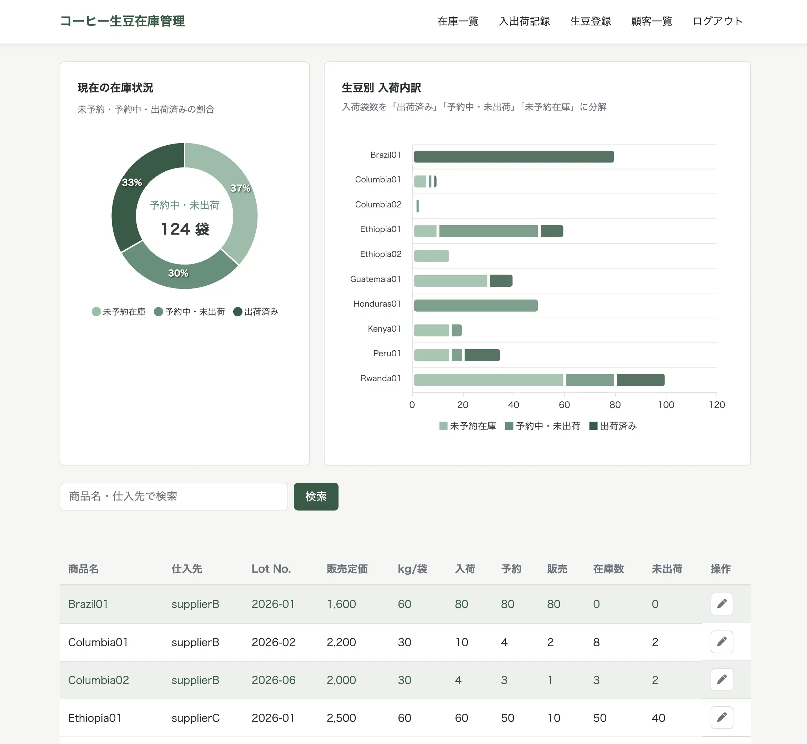

# ①課題名

コーヒー生豆在庫管理

## ②課題内容（どんな作品か）

- 海外から入荷したコーヒー生豆の在庫を、ロットごとに入荷・予約・販売の3種類の動きで管理するアプリです。

## ③アプリのデプロイURL

- https://gs2026-arakawa.sakura.ne.jp/kadai07_db1/public/login.php

## ④アプリのログイン用IDまたはPassword（ある場合）

- ユーザー名：admin
- パスワード：mypassword01

## ⑤工夫した点・こだわった点

- セッション管理によるログイン認証を実装しました。
- `beans`（生豆）・`stock_movements`（入出荷記録）・`customers`（顧客）の3テーブルをJOINし、`SUM(CASE WHEN ...)` を使ったSQL側での集計で、生豆ごとの入荷・予約・販売の合計数を1クエリで取得しています。
- 入出荷記録の登録時に、販売なら「在庫（入荷－販売）を超えていないか」、予約なら「空き在庫（入荷－予約）を超えていないか」をPHP側でチェックし、業務ロジックとして矛盾するデータが登録されないようにしました。

## ⑥難しかった点・次回トライしたいこと（又は機能）

- 在庫・予約の超過チェックなど、複数テーブルにまたがる集計とバリデーションのロジックを整理するのにとても苦戦しました。

## ⑦フリー項目（感想、シェアしたいこと等なんでも）

実際に自分がお手伝いしているコーヒー生豆の卸売業者さんが使えるようなアプリを作成しました。 
（今まで先方はExcelだけで管理されていて、とても苦労されているのを見てきたので...） 
まだ実務で使えるレベルではないですが、今後ブラッシュアップしていけたらと思っています！
